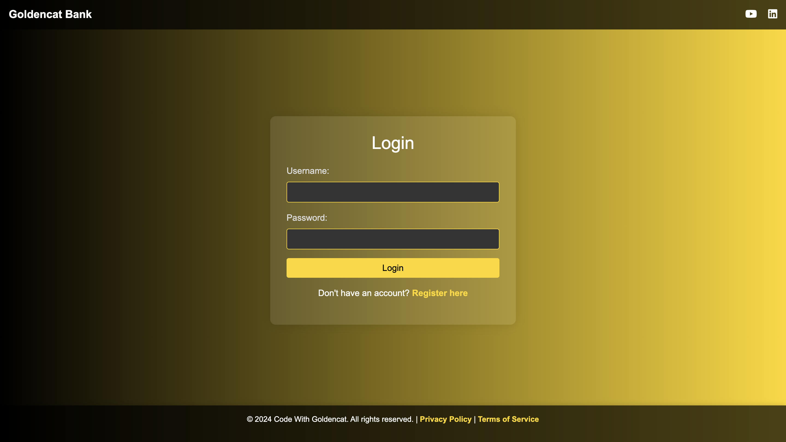

## End-to-End Bank Application Deployment using DevSecOps on AWS EKS
- This is a multi-tier bank an application written in Java (Springboot).




## Tech stack used in this project:
- GitHub (Code)
- Docker (Containerization)
- Jenkins (CI)
- OWASP (Dependency check)
- SonarQube (Quality)
- Trivy (Filesystem Scan)
- ArgoCD (CD)
- AWS EKS (Kubernetes)
- Helm (Monitoring using grafana and prometheus)
  
### Steps to deploy:

### Pre-requisites:
- root user access
```bash
sudo su
```
#
> [!Note]
> This project will be implemented on North California region (us-west-1).

- <b>Create 1 Master machine on AWS (t2.medium) and 29 GB of storage.</b>
#
- <b>Open the below ports in security group</b>


- <b id="EKS">Create EKS Cluster on AWS</b>
- IAM user with **access keys and secret access keys**
- AWSCLI should be configured (<a href="https://github.com/DevMadhup/DevOps-Tools-Installations/blob/main/AWSCLI/AWSCLI.sh">Setup AWSCLI</a>)
  ```bash
  curl "https://awscli.amazonaws.com/awscli-exe-linux-x86_64.zip" -o "awscliv2.zip"
  sudo apt install unzip
  unzip awscliv2.zip
  sudo ./aws/install
  aws configure
  ```

- Install **kubectl**(<a href="https://github.com/DevMadhup/DevOps-Tools-Installations/blob/main/Kubectl/Kubectl.sh">Setup kubectl </a>)
  ```bash
  curl -o kubectl https://amazon-eks.s3.us-west-2.amazonaws.com/1.19.6/2021-01-05/bin/linux/amd64/kubectl
  chmod +x ./kubectl
  sudo mv ./kubectl /usr/local/bin
  kubectl version --short --client
  ```

- Install **eksctl**(<a href="https://github.com/DevMadhup/DevOps-Tools-Installations/blob/main/eksctl%20/eksctl.sh">Setup eksctl</a>)
  ```bash
  curl --silent --location "https://github.com/weaveworks/eksctl/releases/latest/download/eksctl_$(uname -s)_amd64.tar.gz" | tar xz -C /tmp
  sudo mv /tmp/eksctl /usr/local/bin
  eksctl version
  ```
  
- <b>Create EKS Cluster</b>
  ```bash
  eksctl create cluster --name=bankapp \
                      --region=us-west-1 \
                      --version=1.30 \
                      --without-nodegroup
  ```
- <b>Associate IAM OIDC Provider</b>
  ```bash
  eksctl utils associate-iam-oidc-provider \
    --region us-west-1 \
    --cluster bankapp \
    --approve
  ```
- <b>Create Nodegroup</b>
  ```bash
  eksctl create nodegroup --cluster=bankapp \
                       --region=us-west-1 \
                       --name=bankapp \
                       --node-type=t2.medium \
                       --nodes=2 \
                       --nodes-min=2 \
                       --nodes-max=2 \
                       --node-volume-size=29 \
                       --ssh-access \
                       --ssh-public-key=eks-nodegroup-key 
  ```
> [!Note]
>  Make sure the ssh-public-key "eks-nodegroup-key is available in your aws account"
- <b>Install Jenkins</b>
```bash
sudo apt update -y
sudo apt install fontconfig openjdk-17-jre -y

sudo wget -O /usr/share/keyrings/jenkins-keyring.asc \
  https://pkg.jenkins.io/debian-stable/jenkins.io-2023.key
  
echo "deb [signed-by=/usr/share/keyrings/jenkins-keyring.asc]" \
  https://pkg.jenkins.io/debian-stable binary/ | sudo tee \
  /etc/apt/sources.list.d/jenkins.list > /dev/null
  
sudo apt-get update -y
sudo apt-get install jenkins -y
```

- After installing Jenkins, change the default port of jenkins from 8080 to 8081. Because our bankapp application will be running on 8080.
  - Open /usr/lib/systemd/system/jenkins.service file and change JENKINS_PORT environment variable 

  - Reload daemon
  ```bash
  sudo systemctl daemon-reload 
  ```
  - Restart Jenkins
  ```bash
  sudo systemctl restart jenkins
  ```
#

- <b id="docker">Install docker</b>

```bash
sudo apt install docker.io -y
sudo usermod -aG docker ubuntu && newgrp docker
```
#
- <b id="Sonar">Install and configure SonarQube</b>
```bash
docker run -itd --name SonarQube-Server -p 9000:9000 sonarqube:lts-community
```
#
- <b id="Trivy">Install Trivy</b>
```bash
sudo apt-get install wget apt-transport-https gnupg lsb-release -y
wget -qO - https://aquasecurity.github.io/trivy-repo/deb/public.key | sudo apt-key add -
echo deb https://aquasecurity.github.io/trivy-repo/deb $(lsb_release -sc) main | sudo tee -a /etc/apt/sources.list.d/trivy.list
sudo apt-get update -y
sudo apt-get install trivy -y
```
#
- <b id="Argo">Install and Configure ArgoCD</b>
  - <b>Create argocd namespace</b>
  ```bash
  kubectl create namespace argocd
  ```
  - <b>Apply argocd manifest</b>
  ```bash
  kubectl apply -n argocd -f https://raw.githubusercontent.com/argoproj/argo-cd/stable/manifests/install.yaml
  ```
  - <b>Make sure all pods are running in argocd namespace</b>
  ```bash
  watch kubectl get pods -n argocd
  ```
  - <b>Install argocd CLI</b>
  ```bash
  curl --silent --location -o /usr/local/bin/argocd https://github.com/argoproj/argo-cd/releases/download/v2.4.7/argocd-linux-amd64
  ```
  - <b>Provide executable permission</b>
  ```bash
  chmod +x /usr/local/bin/argocd
  ```
  - <b>Check argocd services</b>
  ```bash
  kubectl get svc -n argocd
  ```
  - <b>Change argocd server's service from ClusterIP to NodePort</b>
  ```bash
  kubectl patch svc argocd-server -n argocd -p '{"spec": {"type": "NodePort"}}'
  ```
  - <b>Confirm service is patched or not</b>
  ```bash
  kubectl get svc -n argocd
  ```
  - <b> Check the port where ArgoCD server is running and expose it on security groups of a k8s worker node</b>
  
  - <b>Access it on browser, click on advance and proceed with</b>
  ```bash
  <public-ip-worker>:<port>
  ```
  
  
  
  - <b>Fetch the initial password of argocd server</b>
  ```bash
  kubectl -n argocd get secret argocd-initial-admin-secret -o jsonpath="{.data.password}" | base64 -d; echo
  ```
  - <b>Username: admin</b>
  - <b> Now, go to <mark>User Info</mark> and update your argocd password
#

- Create BankApp-CD job, same as CI job.
#
- <b>Provide permission to docker socket so that docker build and push command do not fail</b>
```bash
chmod 777 /var/run/docker.sock
```


- <b>Now, go to <mark>Applications</mark> and click on <mark>New App</mark></b>


> [!Important]
> Make sure to click on the <mark>Auto-Create Namespace</mark> option while creating argocd application


- <b>Congratulations, your application is deployed on AWS EKS Cluster</b>


- <b>Open port 30080 on worker node and Access it on browser</b>
```bash
<worker-public-ip>:30080
```
- <b>Email Notification</b>


#
## How to monitor EKS cluster, kubernetes components and workloads using prometheus and grafana via HELM (On Master machine)
- <p id="Monitor">Install Helm Chart</p>
```bash
curl -fsSL -o get_helm.sh https://raw.githubusercontent.com/helm/helm/main/scripts/get-helm-3
```
```bash
chmod 700 get_helm.sh
```
```bash
./get_helm.sh
```

#
-  Add Helm Stable Charts for Your Local Client
```bash
helm repo add stable https://charts.helm.sh/stable
```

#
- Add Prometheus Helm Repository
```bash
helm repo add prometheus-community https://prometheus-community.github.io/helm-charts
```

#
- Create Prometheus Namespace
```bash
kubectl create namespace prometheus
```
```bash
kubectl get ns
```

#
- Install Prometheus using Helm
```bash
helm install stable prometheus-community/kube-prometheus-stack -n prometheus
```

#
- Verify prometheus installation
```bash
kubectl get pods -n prometheus
```

#
- Check the services file (svc) of the Prometheus
```bash
kubectl get svc -n prometheus
```

#
- Expose Prometheus and Grafana to the external world through Node Port
> [!Important]
> change it from Cluster IP to NodePort after changing make sure you save the file and open the assigned nodeport to the service.

```bash
kubectl edit svc stable-kube-prometheus-sta-prometheus -n prometheus
```


#
- Verify service
```bash
kubectl get svc -n prometheus
```

#
- Now,let’s change the SVC file of the Grafana and expose it to the outer world
```bash
kubectl edit svc stable-grafana -n prometheus
```


#
- Check grafana service
```bash
kubectl get svc -n prometheus
```

#
- Get a password for grafana
```bash
kubectl get secret --namespace prometheus stable-grafana -o jsonpath="{.data.admin-password}" | base64 --decode ; echo
```
> [!Note]
> Username: admin

#
- Now, view the Dashboard in Grafana


#
## Clean Up
- <b id="Clean">Delete eks cluster</b>
```bash
eksctl delete cluster --name=bankapp --region=us-west-1
```

#
